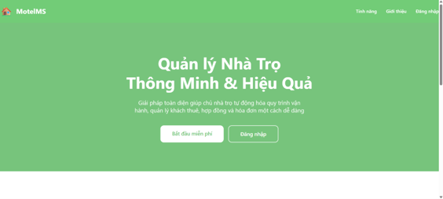
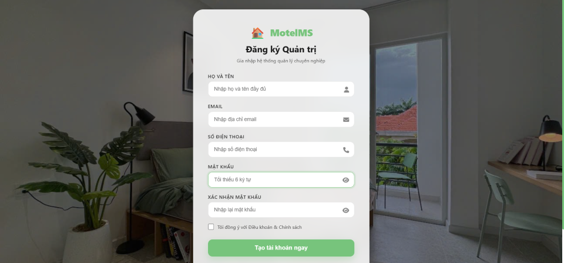

# Motel Management System (MotelMS)


A comprehensive Web-based system designed to digitize and automate the operation and management of motels. This project was built from scratch by strictly applying **Object-Oriented Analysis and Design (OOAD)** principles, from requirements gathering and UML modeling to the actual source code deployment.

**[Read the Detailed OOAD Design Analysis Report (PDF)](https://drive.google.com/file/d/1vMf_tv0G1zyiJEI4u2CPd-BA9_GxXqeg/view?usp=sharing)**

---

## 📸 System UI (Visuals)

*(Dashboard Overview and Revenue Monitoring)*


*(Login and Accommodation Contract Management)*


---

## Project Goals & Applied Skills (For Recruiters)
This project was developed to consolidate and demonstrate the core skills of a Software Engineer Intern:
* **System Design:** Applied UML (Use Case, Activity, Sequence, Class Diagram) to extensively model the system before coding.
* **RESTful API Development:** Built standard REST APIs using Node.js and Express to efficiently manage data flow between the Client and Server.
* **Database Management:** Designed a normalized Relational Database Schema (RDBMS) on SQL Server, ensured data integrity (Constraints, Foreign Keys), and wrote complex queries for invoice calculations and statistics.
* **Problem Solving:** Developed algorithms for the automatic calculation of electricity and water costs based on monthly consumption differences and managed real-time room statuses.

---

## Key Features
* **Accommodation Management (Core Module):** Visual management of room statuses (Available, Occupied, Under Maintenance). Managed the contract lifecycle from creation to liquidation.
* **Financial Automation:** Automatically calculates room rent and service costs (electricity, water, garbage, Wi-Fi) based on finalized monthly utility readings.
* **Statistical Dashboard:** An overview interface for real-time tracking of occupancy rates, total revenue, and lists of tenants with outstanding payments.

---

## Architecture & Technologies
* **Architecture Pattern:** Client-Server (Monolithic Architecture)
* **Frontend:** HTML5, CSS3, JavaScript (Vanilla) - Interacts with the server via Fetch API.
* **Backend:** Node.js, Express.js.
* **Database:** Microsoft SQL Server (Connected via the `mssql` library).

---

## Installation Guide (Local Environment)

### 1. System Requirements
* [Node.js](https://nodejs.org/) (LTS Version)
* [SQL Server](https://www.microsoft.com/en-us/sql-server/sql-server-downloads) & [SSMS](https://learn.microsoft.com/en-us/sql/ssms/download-sql-server-management-studio-ssms)

### 2. Database Initialization
1. Open SSMS and create a new Login account:
   * Username: `motel_app` | Password: `12345` (Select *SQL Server Authentication*, Status: *Enabled* & *Grant*).
2. Create a new database named `quanlytro`.
3. Open the script file in the `database/` folder, copy all the code, and **Execute** it within the `quanlytro` database to generate the table structures and sample data.
4. In the `User Mapping` section of the `motel_app` account, grant the `db_owner` role for the `quanlytro` database.

### 3. Backend Setup
1. Open your Terminal and navigate to the backend directory: `cd backend`
2. Install the required dependencies: `npm install`
3. Start the Server: `nodemon src/server.js` (or `npx nodemon src/server.js`)
4. The setup is complete when the Terminal displays: **"Kết nối SQL Server thành công"** (SQL Server connection successful).

### 4. Frontend Setup
1. Install the **Live Server** Extension in VS Code.
2. Right-click the `frontend/index.html` file -> Select **Open with Live Server**.
3. The system will automatically launch in your default web browser.

---

## Source Code Structure
```text
motel-management-system/
├── backend/               # API logic and Database connection configurations
│   ├── src/
│   │   ├── controllers/   # Business logic handling for each module
│   │   ├── routes/        # API Endpoints routing
│   │   └── server.js      # Entry point to start the server
├── frontend/              # User Interface
│   ├── css/
│   ├── js/                # Logic for API calls and DOM manipulation
│   └── index.html
├── database/              # Contains the script file (.sql) to initialize the DB
├── assets/                # Project illustration images
├── Report OOAD MotelMS_2.pdf # System analysis and design documentation
└── README.md
```

*Feel free to reach out via [truongxuan2834@gmail.com](mailto:truongxuan2834@gmail.com) for any discussion regarding this project.*


